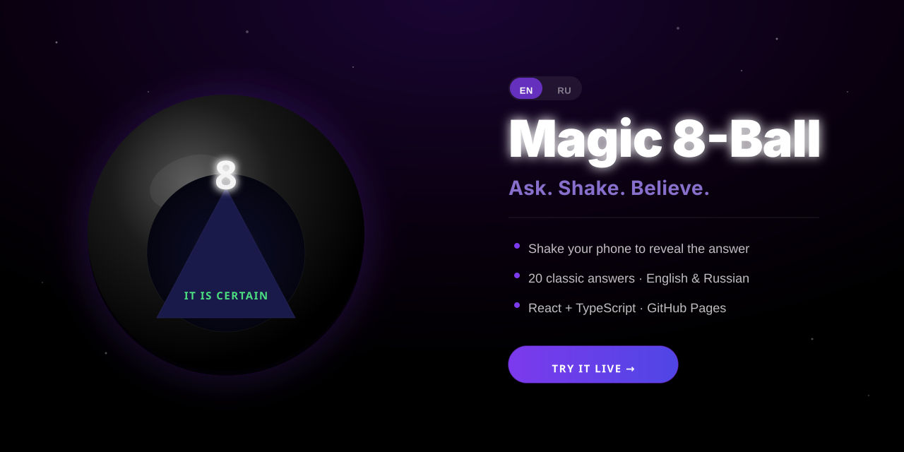

# 🎱 Magic 8-Ball



A mystical Magic 8-Ball web app — think your question, shake your phone (or tap the button), and receive your answer from the universe.

**🔮 Live app → [zhannam85.github.io/magic-ball](https://zhannam85.github.io/magic-ball/)**

---

## Features

- **Shake detection** — uses the `DeviceMotionEvent` API on mobile; iOS 13+ asks for permission once, and gracefully falls back to button-only mode if denied
- **Shake button** — always visible, works on desktop and any device regardless of motion permission
- **20 classic answers** — 10 positive, 5 neutral, 5 negative, colour-coded green / yellow / red
- **English & Russian** — auto-detects nothing (Russian is the default); toggle with the EN / RU switcher in the top-right corner, choice is saved across visits
- **Smooth animations** — wobble shake, triangle window fade-in, answer text fade-up
- **Mobile-first** — optimised for phones, works in all modern browsers
- **Capacitor-ready** — structured for a future App Store / Google Play release with minimal changes

---

## Tech stack

| | |
|---|---|
| Framework | React 18 + TypeScript (strict) |
| Build tool | Vite 5 |
| i18n | react-i18next + i18next-browser-languagedetector |
| Styling | CSS Modules (no UI library) |
| Hosting | GitHub Pages via GitHub Actions |
| Future mobile | Capacitor (stub committed, ready to add) |

---

## Getting started

```bash
# Install dependencies
npm install

# Start dev server
npm run dev

# Production build
npm run build

# Preview production build locally
npm run preview
```

---

## Project structure

```
src/
├── components/
│   ├── MagicBall.tsx        # The ball visual + shake button
│   └── LanguageSwitcher.tsx # EN / RU toggle
├── hooks/
│   └── useDeviceMotion.ts   # Shake detection (Capacitor swap-point)
├── data/
│   └── answers.ts           # 20 classic answers × 2 languages
├── i18n/
│   ├── index.ts             # i18next initialisation
│   └── locales/
│       ├── en.ts            # English UI strings
│       └── ru.ts            # Russian UI strings
├── styles/                  # CSS Modules
├── types/index.ts           # Shared TypeScript types
└── App.tsx                  # State machine & orchestration
```

---

## Deployment

Every push to `main` automatically builds and deploys to GitHub Pages via GitHub Actions (`.github/workflows/deploy.yml`). No manual steps needed.

---

## Adding Capacitor (future mobile)

A `capacitor.config.ts` stub is already committed. When ready:

```bash
npm install @capacitor/core @capacitor/cli @capacitor/ios @capacitor/android
npx cap add ios
npx cap add android

# Build for native (overrides the GitHub Pages base path)
npx vite build --base /
npx cap sync
npx cap open ios
```

To use native shake detection, replace the `DeviceMotionEvent` listener in `src/hooks/useDeviceMotion.ts` with `@capacitor/motion`.
